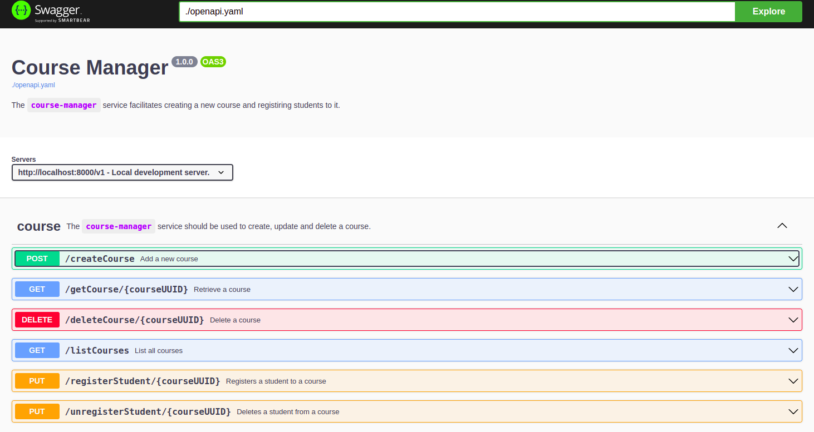

# course-manager
A simple web service facilitating student registry to given courses. 


Note that this is an example backend service for educational purposes. It has been created for the [Building Backend Service in Go](https://github.com/tomasdembelli/building-backend-service-in-go) project.

The API endpoints can be investigated by running `make docs` on [swagger-UI](http://localhost:8080/).



Available Make commands can be seen by running `make help`.
```shell
build.web   Build the web container
help        Show this help
start       Run the application locally in the background
stop        Stop the application
clean       Remove containers and delete all data from the local volumes
shell       Shell into a development container
logs        Show the application logs
run         Run the application locally
docs        Run the documentation service
lint        Lint the application code
test        Run unit tests

```